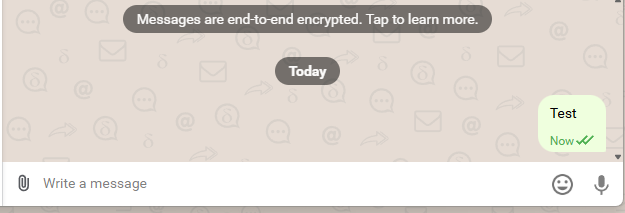

# Delta Chat Bots - REST API Connector
Code in this repository gives an access to the Delta Chat - Bot APIs (RPC) via REST API

Small private Delta Chat bot project with:

- a local REST API for Delta Chat RPC calls
- outbound webhook delivery for incoming messages
- simple event logging for Delta Chat raw events

## Setup
### Step 1. Environment Variables
Create a `.env` file in the project root:

```env
BOT_CLI_NAME=REST_API_Relay
LOG_LEVEL=info # optional

ENABLE_WEBHOOK=true
WEBHOOK_URL=https://webhook.site/your-webhook-url

API_PORT=8000
API_HOST=127.0.0.1
API_KEY=supersecretkey
```
Take a look at .env.example for reference.

### Step 2. Create virtual environment
#### On Windows:
```
python -m venv .venv
.\.venv\Scripts\Activate.ps1
```

#### On Linux
```
python3 -m venv .venv
source .venv/bin/activate
```
### Step 3. Install requirements
```
pip install -r requirements.txt
```
Note: sometimes you might need to run pip3 instead of pip.

### Step 4. Create new Bot account in Delta Chat and get an invite link

### Create a bot
Run the following CLI command:
```
python ./main.py init DCACCOUNT:https://nine.testrun.org/new
python ./main.py config displayname "My Rest API Bot"
```
Note: if you have multiple bots, you need to run:
```
python ./main.py -a 1 config displayname "My Rest API Bot"
```
Where -a 1 is an account + an account id (from ```python ./main.py list```)

P.S. https://nine.testrun.org/new - test relay, you might want to use another Delta Chat relay. For me this one works fine.
### Get Invitation Link
```
python ./main.py link
```
Copy this link to later connect to the bot.
Important: Do not click on it now, first start serving - otherwise (at the moment of writing) it will not accept your connection request.


## Start
### Step 1. Activate virtual environment
Note: if you run it right after the setup step, you can skip this step.
#### On Windows:
```
.\.venv\Scripts\Activate.ps1
```

#### On Linux
```
source .venv/bin/activate
```

### Step 2. Start the bot
```
python ./main.py serve
```

### Step 3. Connect to the bot
Use connection url from setup (sub-step 4 - Get Invitation Link)

When you send messages to the bot, it will change status of messages:


In the background it will send new messages to your desired REST-API Endpoint (logs will be in python run logs).

## Doing API Requests
Feel free to start with Bruno collection template that I have created for that. You need to specify Environment Variables to start, at least set your API_KEY.
### Health Status Check
When instance runs, you shall be able to get the health status:
```
curl --request GET \
  --url http://127.0.0.1:8000/health \
  --header 'authorization: Bearer supersecretkey'
```
### Send message via API

You can send a message via call to RPC like that:
```
curl --request POST \
  --url http://127.0.0.1:8000/rpc \
  --header 'authorization: Bearer supersecretkey' \
  --header 'content-type: application/json' \
  --data '{
  "method": "send_msg",
  "params": [
    1,
    10,
    {
      "text": "hello from rpc"
    }
  ]
}'
```

In this request:
method: send_msg - RPC Method that we will be using
params 1 - Local Bot Account ID (you can get it from Bruno 'Get All Account Ids' or run ```python ./main.py list```)
params 2 - Target Chat ID. You can get it from logs, NewMsgEvent -> msg -> chat_id
JSON Object after it - Message that will be sent.

Apart from that - good luck and god help you with funding what have to be in the request. At the moment of writing there is no docu for that.

## Hints:

### To deactivate a virtual environment
```
deactivate
```

### If you want to debug:
You can change in .env log level to 'debug' or 'finest'. Default is 'info'

### Help with Bot CLI:
```
python ./main.py -h
```

### REST API - RPC Documentation
There is no documentation at the moment of writing, so good luck with that. I used the following repo:
https://github.com/chatmail/core/blob/main/deltachat-jsonrpc/src/api.rs#L742

In addition I looked through the installed site-packages for usage reference. For example I do ```CTRL+SHIFT+F```: ```self.rpc.set_config``` and try to find how certain request is actually being done.


## Credits:

Many thanks to this guide:
https://bots.delta.chat/quickstart.html

At the moment of writing it was far away from being complete, but it actually really helped to start.